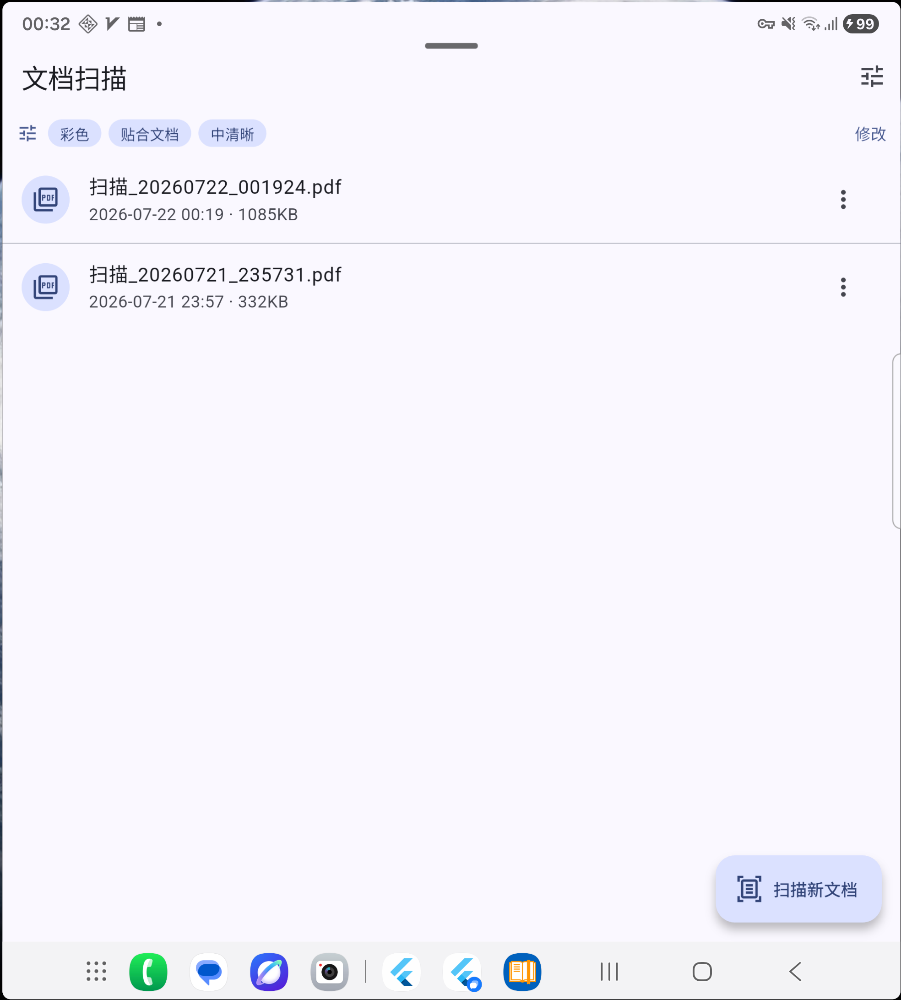

# 文档扫描 · scan-pdf-android

[](https://github.com/Eddie57310/scan-pdf-android/actions/workflows/build-apk.yml)
[](./LICENSE)
[](https://flutter.dev)

用手机相机把纸质文件扫描成 PDF。**自动检测边缘、自动纠偏 / 旋转**，一键生成 PDF 并可分享。
一套 Flutter 代码，同时面向 **Android 和 iOS**（当前 Android 已完整可用）。

<p align="center">
  
</p>

## 核心特性

- **打开即扫**：点一下就调起系统级扫描器
- **自动边缘检测 + 纠偏 + 旋转**：
  - Android 用 **Google ML Kit 文档扫描器**
  - iOS 用苹果原生 **VisionKit**（和「文件」App 里的扫描同款）
- **扫描前预设**（设置页，会记住）：
  - 颜色：彩色 / 黑白
  - 页面尺寸：贴合文档（无白边） / A4 / A3
  - 文件清晰度：普通 / 中 / 高
- **多页连拍**：一份文件可连续拍多页
- **一键生成 PDF**，自动按时间命名（`扫描_yyyyMMdd_HHmmss.pdf`）
- **保存 / 分享**：调用系统分享菜单（微信、邮件、文件 App 等）
- 首页列出历史扫描件，可打开预览、分享、删除

## 下载安装（Android）

1. 打开本仓库的 **[Releases](https://github.com/Eddie57310/scan-pdf-android/releases)** 页面，下载最新的 `app-release.apk`
   （或到 **[Actions](https://github.com/Eddie57310/scan-pdf-android/actions)** 里任一次成功构建的 Artifacts 下载）
2. 传到手机点击安装，首次需在系统设置里允许「未知来源 / 该浏览器安装应用」
3. **保持联网**首次打开：Google 扫描组件会自动下载一次（几 MB，之后离线可用）

## 技术栈

| 用途 | 包 |
| --- | --- |
| 扫描内核（边缘检测 / 纠偏 / 旋转） | `cunning_document_scanner` |
| 生成 PDF | `pdf` |
| 图像处理（黑白 / 缩放 / 压缩） | `image` |
| 设置持久化 | `shared_preferences` |
| 存储路径 | `path_provider` |
| 分享 | `share_plus` |
| 打开预览 | `open_filex` |

主程序 `lib/main.dart`；设置相关 `lib/scan_settings.dart`、`lib/settings_page.dart`。

## 平台要求

- **Android**：minSdk 24；release 包已**关闭 R8 混淆**（`android/app/build.gradle.kts`），
  否则混淆会删掉 ML Kit 初始化所需构造函数，导致扫描器无法启动
- **iOS**：iOS 13+（VisionKit 要求）；相机 / 相册权限说明已加入 `ios/Runner/Info.plist`

## 本地开发

```bash
flutter pub get
flutter analyze                 # 静态分析
flutter test                    # 跑测试
flutter run                     # 插上安卓手机(开 USB 调试)直接运行
flutter build apk --release     # 编译正式安装包 → build/app/outputs/flutter-apk/app-release.apk
```

## 自动构建（CI）

`.github/workflows/build-apk.yml` 已配置好：

- **push 到 `main`**：自动编译 APK，存为构件（Actions 页面可下载）
- **打 `v*` 标签**（如 `v1.0.0`）：额外创建 Release 并附上 APK

发一个正式版本：

```bash
git tag v1.0.0
git push origin v1.0.0
# 稍等几分钟，Releases 页面就会出现带 APK 的 v1.0.0
```

## iOS 怎么出包？

Linux / Windows **无法**编译 iOS 安装包（苹果限制，Xcode 只在 macOS 上）。代码已跨平台、iOS 端无需改动，将来二选一：

1. **用一台 Mac**：装 Xcode，项目根目录 `flutter build ipa`
2. **云端 CI**（无需自备 Mac）：如 Codemagic / GitHub Actions 的 macOS runner

> 注意：iOS 即使只装到自己手机也需要苹果账号签名（免费 Apple ID 7 天有效；付费开发者账号 $99/年 可用 TestFlight / 上架）。

## License

[MIT](./LICENSE) © 2026 Eddie57310
